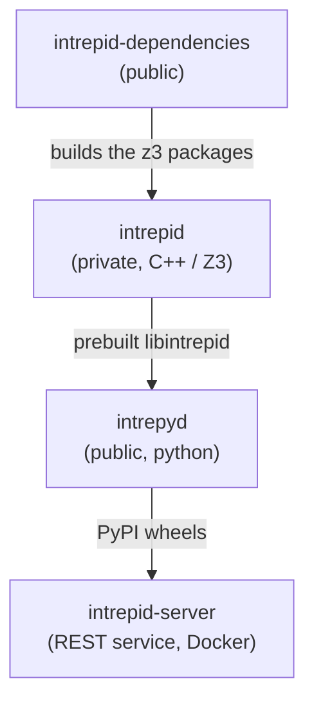
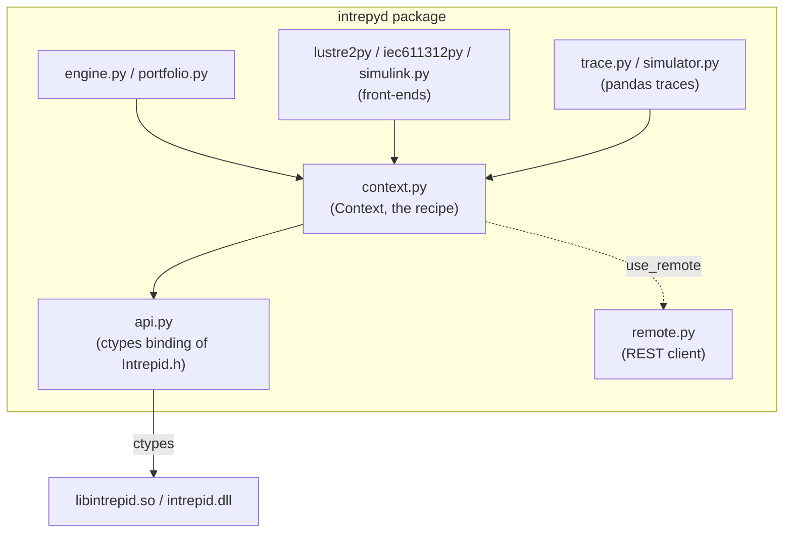

# Architecture

This section is for people working on intrepyd itself, rather than using it.
It assumes the [user guide](../guide/building-models.md).

## The three repositories

Intrepyd is the top of a stack of three repositories, released in this order:

- **intrepid-dependencies** builds the z3 packages that intrepid links against.
- **intrepid** is the C++17 model-checking library, `libintrepid`, built on Z3.
  It is private, and comes to intrepyd as a prebuilt shared library with a
  plain C API (`Intrepid.h`). Its own internals — the net stores, circuits,
  unroller, solvers and engines, and how BMC, k-induction, backward
  reachability and IC3/PDR work — are documented in the **developer guide of
  the intrepid repository** (`docs/developer-guide.md` there), not here.
- **intrepyd** is this pure-python package.
- **intrepid-server** is the REST service and Docker image; it installs
  intrepyd from PyPI and is released on its own schedule.

The release order matters: a change to the C++ engines reaches intrepyd only
after an intrepid release, and reaches the service only after an intrepyd
release and a pin bump in intrepid-server.

## Inside intrepyd

- **`api.py`** exposes each function of intrepid's C API, `Intrepid.h`, under
  the same name, bound with `ctypes` by `_bind`. Strings go in and come out as
  `str`, handles are opaque values (`None` for `NULL`), nets are ints, and an
  error reported by the library raises `RuntimeError`. Everything else in
  intrepyd talks to the library only through this module.
- **`context.py`** is the `Context`, the factory for types, nets, engines,
  traces and simulators. Every call that builds the circuit is recorded in a
  *recipe* (`recipe.py`), so the circuit can be rebuilt in another process —
  which is how the [portfolio](../guide/portfolio.md) works and why circuits
  must be built through `Context`, not through `api.py` directly.
- **`engine.py`** and **`portfolio.py`** are the engines and the parallel
  portfolio; **`trace.py`** and **`simulator.py`** are the pandas-based traces
  and the simulator; the **front-ends** translate Lustre, IEC 61131-3 and
  Simulink into a `Circuit` (`circuit.py`); **`remote.py`** is the REST client
  that `use_remote()` switches `Context` over to.

Intrepyd itself is pure python: there is nothing to compile, and one build of
the library serves every python version.

## Moving to a new intrepid release

`api.py` is the one place tied to the C API. To move to a new release of
intrepid, set `INTREPID_VERSION` and run `make fetch_intrepid && make`. If the
C API changed, `test_api.py` reports the functions whose signature no longer
matches the checked-in `Intrepid.h`; update the `_bind` lines in `api.py` to
follow.
