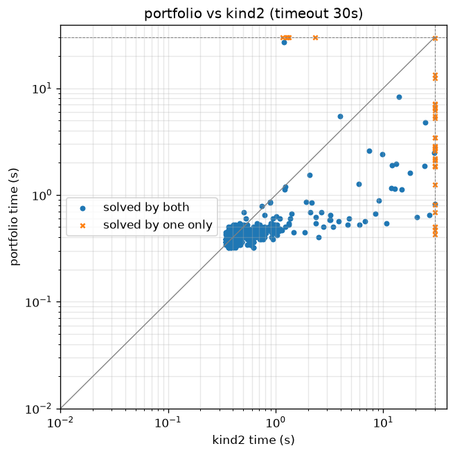
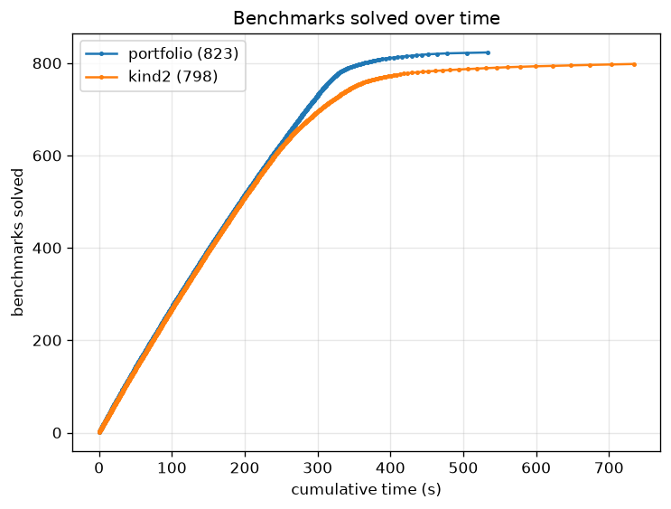

# Performance against Kind2

How intrepyd compares to [Kind2](https://kind2-mc.github.io/kind2/), the
reference model checker for Lustre, on the Kind2 benchmark set, with a **30
second timeout**. The comparison is run with the benchmark harness
(`benchmarks/harness.py`); this page describes the method and the two plots it
produces, and gives the exact commands so the numbers can be regenerated.

## Method

- **Same machine, same budget.** Every tool runs on the same machine, each run
  in its own process, with a 30 s timeout and a memory cap, and each tool gets
  the same number of cores — a single engine one core, a portfolio (intrepyd's
  or Kind2's) the same `--portfolio-cpus`.
- **Same semantics.** Kind2 reads Lustre `int` as unbounded integers, so the
  comparison uses `--int-type int`; the 32-bit encoding (`int32`) is reported
  apart. Only benchmarks on which the two tools **agree** on the verdict are
  compared for speed; disagreements are bugs and are reported separately.
- **What is compared.** intrepyd's portfolio against Kind2's default portfolio,
  and engine by engine (BMC, k-induction, IC3) against the matching Kind2
  engine.

## Results

The run below is on the 848-benchmark Kind2 set, with Kind2 3.0.0 (and the z3
5.0.0 it ships with), unbounded `int` semantics, a 30 s timeout, on a 16-core
machine. It compares intrepyd's portfolio against Kind2's default portfolio.

| Tool | Solved (of 848) | Valid | Invalid | Timed out | Errored |
| ---- | --------------: | ----: | ------: | --------: | ------: |
| intrepyd portfolio | **823** | 471 | 352 | 25 | 0 |
| Kind2 portfolio    | 798     | 453 | 345 | 48 | 2 |

On every one of the 793 benchmarks both tools solve within the budget they
return the **same verdict** — there are no disagreements, the soundness check
that matters most. Of the rest, 30 are solved only by intrepyd and 5 only by
Kind2.

### Scatter plot

One point per benchmark, Kind2's time on the x axis and intrepyd's on the y
axis, log-log, with the timeout as the border. A point below the diagonal is a
benchmark intrepyd solves faster; a point on a border line is one only that
tool solved within the budget.



### Benchmarks solved over time

A cactus plot: the number of benchmarks solved against cumulative time, one
curve per tool. A curve that reaches higher solves more within the budget; a
curve further left is faster.



### Reading

- **intrepyd solves more within the budget** — 823 against 798 — and times out
  on half as many benchmarks (25 against 48). It also clears its set in less
  total time (534 s against 734 s).
- **The two never disagree.** Across the 793 both solve, every verdict matches.
- **Where each one wins alone.** The 30 that only intrepyd solves are
  invariant-heavy problems (the `memory1`/DRAGON, `simulation` and `large`
  families) on which Kind2's portfolio times out; the 5 that only Kind2 solves
  are all in `large/microwave`.
- **On the common ground they are close.** Of the 793 both solve, intrepyd is
  faster on 431 and Kind2 on 362 — a small edge to intrepyd, decided benchmark
  by benchmark rather than across the board.

## Regenerating the numbers

```bash
# 1. Run both tools on the benchmarks with a 30 s timeout (needs Kind2 and the
#    z3 it uses; this takes a while)
python benchmarks/harness.py run results-int.jsonl \
    --tools portfolio,bmc,kind,pdr,kind2,kind2_bmc,kind2_kind,kind2_ic3 \
    --int-type int --timeout 30 --kind2 /path/to/kind2 --z3 /path/to/z3

# 2. Check the two tools agree where they both answer
python benchmarks/harness.py report results-int.jsonl --expected benchmarks/kind2-benchmarks.txt

# 3. Produce the plots
python benchmarks/harness.py plot results-int.jsonl \
    --pair portfolio,kind2 --out-dir docs/assets/benchmarks
```

Step 3 writes `scatter.png` and `cactus.png`. The run is machine-dependent, so
the plots shown above are produced on the reference benchmarking machine and
committed under `docs/assets/benchmarks/`; re-running the three steps there
refreshes the numbers and the plots on this page.

See also the [benchmarking guide](benchmarking.md) for running a single
benchmark, and [model checking](model-checking.md) for the engines themselves.
