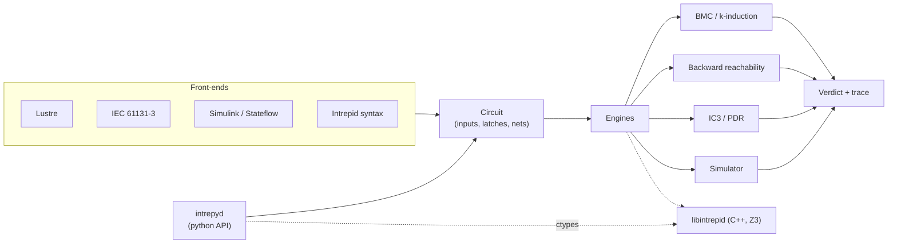
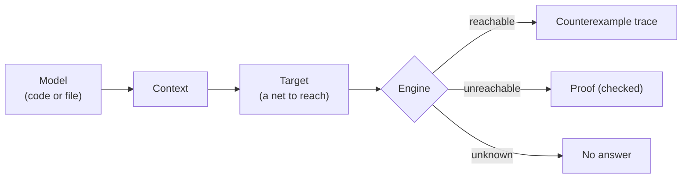

# Intrepyd

Intre**py**d is a **python** library that provides a **simulator** and a
**model checker** as a rich API, for the rapid prototyping of formal-methods
algorithms and the rigorous analysis of circuits, specifications and models.

It pairs an expressive, pandas-friendly Python API with a fast C++ engine core
built on the [Z3](https://github.com/Z3Prover/z3) SMT solver, and reads models
written in Lustre, IEC 61131-3 Structured Text and Simulink.

<div class="grid cards" markdown>

-   :material-rocket-launch: **Get started**

    Install from PyPI and build your first model in a few lines.

    [:octicons-arrow-right-24: Installation](guide/installation.md)

-   :material-sitemap: **Build models**

    Contexts, types, nets, latches and assumptions.

    [:octicons-arrow-right-24: Building models](guide/building-models.md)

-   :material-shield-check: **Prove properties**

    BMC, k-induction, backward reachability and IC3/PDR.

    [:octicons-arrow-right-24: Model checking](guide/model-checking.md)

-   :material-code-braces: **API reference**

    Every public class and function, generated from the code.

    [:octicons-arrow-right-24: API reference](reference/index.md)

</div>

## How it fits together

Intrepyd is built in two layers: a thin, pure-python API on top of a prebuilt
C++ library.



- **intrepid** — a C++17 model-checking library built on Z3. It provides a
  net/circuit representation, an unroller and four engines: bounded model
  checking (with k-induction), backward reachability, IC3/PDR and a simulator.
  It is developed in a separate, private repository and ships here as a
  prebuilt shared library with a plain C API.
- **intrepyd** — this python package. It loads the library with `ctypes` and
  adds a portfolio that runs the engines in parallel, front-ends for Lustre,
  IEC 61131-3 Structured Text and Simulink, and pandas-based traces.

Intrepyd itself is pure python: there is nothing to compile, and one build of
the library serves every python version.

## A first taste

```python
import intrepyd as ip
from intrepyd.engine import EngineResult

ctx = ip.Context()
int_t = ctx.mk_int_type()

# A counter that starts at 0 and only ever increases
c = ctx.mk_latch('c', int_t)
ctx.set_latch_init_next(c, ctx.mk_number('0', int_t),
                        ctx.mk_add(c, ctx.mk_number('1', int_t)))

# Prove that the counter is never negative
pdr = ctx.mk_pdr()
pdr.add_target(ctx.mk_eq(c, ctx.mk_number('-1', int_t)))
assert pdr.reach_targets() == EngineResult.UNREACHABLE   # invariant: c >= 0
```

Read on in the [guide](guide/installation.md), or jump to the
[API reference](reference/index.md).

## The flow of an analysis


